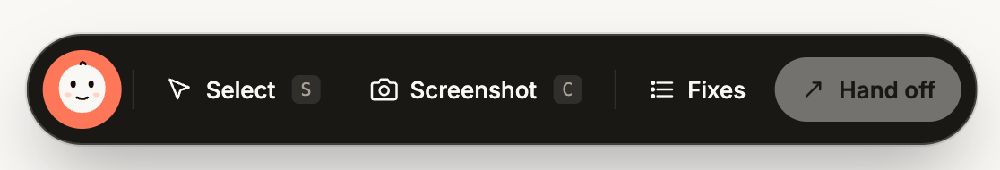

# Charlie fixes



Pinch it, prompt it. A floating overlay that lets you pick DOM elements on any page, write comments, and copy the whole batch as a single prompt for your AI agent (Claude, Cursor, Copilot — whatever you paste into).

Built for "vibe coders" and developers who want to walk through a running site, point at what's broken, describe the fix, and hand the whole batch to an agent in one paste.

---

## Install

### Option 1 — Drop-in `<script>` tag (any project)

Add one line to your HTML (or dev layout):

```html
<script src="https://unpkg.com/charlie-fixes"></script>
```

That's it. A toolbar appears at the bottom of every page the script loads on. Nothing else to configure.

### Option 2 — npm install (bundler projects)

```bash
npm install charlie-fixes
# or: pnpm add charlie-fixes / yarn add charlie-fixes
```

Then import it once — anywhere that runs on the client:

```ts
import 'charlie-fixes';
```

The toolbar auto-mounts. Import it and forget it.

### Option 3 — React component

Install `charlie-fixes` and import the wrapper from `charlie-fixes/react`. The component renders nothing — the overlay paints itself into `document.body`.

**Next.js (App Router)** — `app/layout.tsx`:

```tsx
import { CharlieFixes } from 'charlie-fixes/react';

export default function RootLayout({ children }: { children: React.ReactNode }) {
  return (
    <html>
      <body>
        {children}
        {process.env.NODE_ENV === 'development' && <CharlieFixes />}
      </body>
    </html>
  );
}
```

**Plain React / Vite** — drop it into your root component:

```tsx
import { CharlieFixes } from 'charlie-fixes/react';

{import.meta.env.DEV && <CharlieFixes accent="oklch(0.72 0.17 35)" />}
```

Props: `accent?: string`, `enabled?: boolean` (default `true`). Toggle `enabled` to mount/unmount the overlay at runtime.

### Option 4 — Vue component

Install `charlie-fixes` and import the wrapper from `charlie-fixes/vue`.

**Vue 3** — `main.ts`:

```ts
import { createApp } from 'vue';
import App from './App.vue';
import { CharlieFixes } from 'charlie-fixes/vue';

createApp(App).component('CharlieFixes', CharlieFixes).mount('#app');
```

```vue
<template>
  <CharlieFixes v-if="isDev" accent="oklch(0.72 0.17 35)" />
</template>

<script setup lang="ts">
const isDev = import.meta.env.DEV;
</script>
```

**Nuxt 3** — gate on dev and wrap in `<ClientOnly>` (the overlay is browser-only):

```vue
<template>
  <ClientOnly>
    <CharlieFixes v-if="dev" />
  </ClientOnly>
</template>

<script setup lang="ts">
import { CharlieFixes } from 'charlie-fixes/vue';
const dev = process.dev;
</script>
```

Props: `accent?: string`, `enabled?: boolean` (default `true`).

---

## Dev-only installation (recommended)

You almost certainly don't want Charlie loaded in production. Gate it on your dev environment.

### Vanilla HTML

```html
<script>
  if (location.hostname === 'localhost') {
    const s = document.createElement('script');
    s.src = 'https://unpkg.com/charlie-fixes';
    document.head.appendChild(s);
  }
</script>
```

### Next.js (App Router)

```tsx
// app/layout.tsx
export default function RootLayout({ children }: { children: React.ReactNode }) {
  return (
    <html>
      <body>
        {children}
        {process.env.NODE_ENV === 'development' && (
          <script src="https://unpkg.com/charlie-fixes" async />
        )}
      </body>
    </html>
  );
}
```

### Vite / CRA / Nuxt / SvelteKit

```ts
// e.g. src/main.ts
if (import.meta.env.DEV) {
  import('charlie-fixes');
}
```

### Laravel Blade

```blade
@env('local')
  <script src="https://unpkg.com/charlie-fixes"></script>
@endenv
```

---

## Configuration

Set a global before the script loads:

```html
<script>
  window.__CHARLIE__ = {
    accent: 'oklch(0.72 0.17 35)', // toolbar accent color (any CSS color)
    mount: 'auto',                  // 'manual' to skip auto-mount
  };
</script>
<script src="https://unpkg.com/charlie-fixes"></script>
```

### Manual mount / unmount

If `mount: 'manual'`, the toolbar won't appear until you call it yourself:

```js
window.CharlieFixes.mount();    // show the toolbar
window.CharlieFixes.unmount();  // remove it
```

Useful if you want to toggle Charlie behind a keyboard shortcut or feature flag.

---

## How to use it

1. Click **Select** (or press `S`) — or **Screenshot** (or press `C`) to capture an image
2. Hover elements — Charlie highlights what's under your cursor (or drag a region when cropping)
3. Click the element you want to fix
4. Type what should change, press `⏎` to save
5. Repeat for every issue
6. Click **Hand off** — the full markdown prompt is on your clipboard
7. Paste into Claude, Cursor, Copilot, etc. If you captured screenshots, copy each one from the paste panel and paste it into the chat too.

### Screenshot capture

Click the **Screenshot** button in the toolbar to open a popover with two options:

- **Crop from area** — drag a rectangle anywhere on the page. The pixels under that region are captured with `html2canvas`.
- **Full image** — captures the entire visible viewport.

The composer that opens next lets you write the note just like for element picks, and shows a thumbnail of what you captured. Screenshots save alongside their note and survive reloads (image blobs live in IndexedDB, metadata in `localStorage`).

### Handing off with screenshots

Clicking **Hand off** copies the markdown prompt to your clipboard *and* opens a paste panel listing every screenshot in the queue. Because the browser clipboard only holds one image at a time — and paste targets only read one — the panel gives you two flows:

- **Step through** (recommended for 2+ shots): click **Copy image 1 of N**, paste into Claude Code, click again for image 2, paste, repeat. A **Reset** button jumps back to image 1.
- **Per-image Copy** buttons for random-access copy.
- **Download** button next to each row writes a `charlie-fix-N.png` file to disk — useful if you'd rather drag the PNGs into the chat or let the agent read them via file paths referenced in the prompt (``).

Deleting an item from the fix list also removes its image from IndexedDB.

### Keyboard shortcuts

| Key | Action |
| --- | --- |
| `S` | Start selecting an element |
| `C` | Toggle the Screenshot popover |
| `L` | Toggle the fix list |
| `⏎` | Save the current comment |
| `Esc` | Cancel selection / close composer / close list / close popover |

### What the output looks like

```markdown
# Fix list

The following fixes were collected from a live page using Charlie fixes...

## 1. `button` — header.hero > div > button.btn-primary

**Selector:** `header.hero > div > button.btn-primary`

**Element text:** "Start free — no card"

**Fix:** Make this the brand coral, not blue.

---

## 2. Screenshot region

**Region:** 792×383 at (275, 141)

**Fix:** This card layout feels cramped — more vertical breathing room.


---
```

The queue survives reloads and page navigation via `localStorage` (`charlie-fixes:queue`). Screenshot blobs live in IndexedDB (`charlie-fixes` → `images`) and are cleaned up when the corresponding fix is deleted.

---

## FAQ

**Will it leak styles into my app?**
No. Charlie renders inside a Shadow DOM, so your page's CSS can't reach it and its CSS can't reach your page.

**What about production builds?**
Don't ship it to production. Use the dev-only patterns above.

**Does it capture real screenshots?**
Yes. Click **Screenshot** in the toolbar (or press `C`) and pick **Crop from area** or **Full image**. Real pixels are captured via `html2canvas`, stored in IndexedDB, and made available in a paste panel on **Hand off** — either copy the images one at a time into Claude Code, or download them as `charlie-fix-N.png` files.

**Will Claude Code actually see my screenshots?**
Two ways, both supported:
1. **Paste flow** — after pasting the markdown prompt, click **Copy image** in the paste panel and paste each screenshot into Claude Code directly. The image arrives inline.
2. **File flow** — download the PNGs (button in the paste panel) and drop them in your project next to the prompt. The markdown's `` references resolve, and Claude Code reads them via its Read tool.

**Bundle size?**
~64 kB gzipped with screenshot capture (html2canvas accounts for most of it). Without the screenshot path the overlay itself is ~12 kB; html2canvas only runs when you actually trigger a capture.

---

## License

MIT
